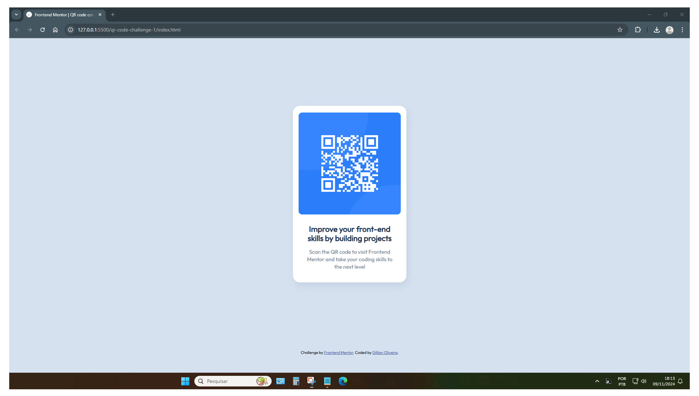
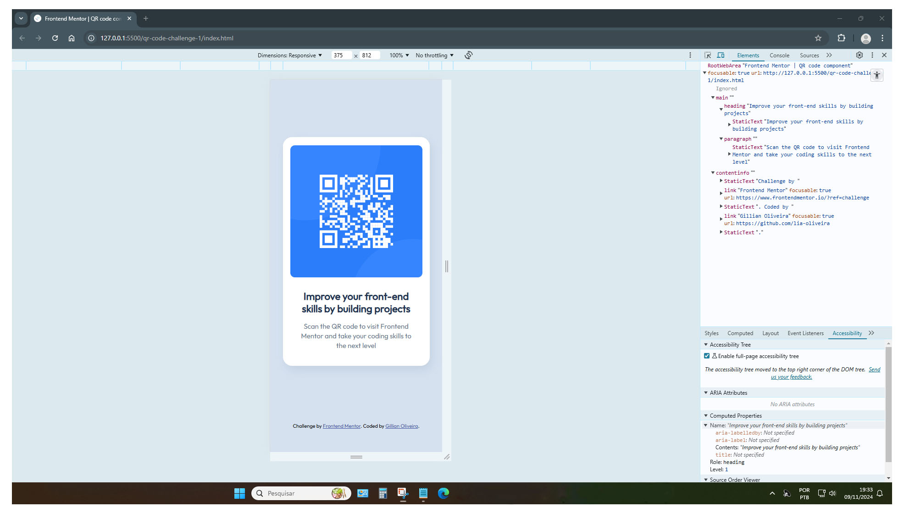

# Frontend Mentor - QR code component solution

This is a solution to the [QR code component challenge on Frontend Mentor](https://www.frontendmentor.io/challenges/qr-code-component-iux_sIO_H).

Frontend Mentor challenges help you improve your coding skills by building realistic projects.

## Table of contents

- [Frontend Mentor - QR code component solution](#frontend-mentor---qr-code-component-solution)
  - [Table of contents](#table-of-contents)
  - [Overview](#overview)
    - [Screenshot](#screenshot)
    - [Links](#links)
  - [My process](#my-process)
    - [Built with](#built-with)
    - [What I learned](#what-i-learned)
    - [Useful resources](#useful-resources)
  - [Author](#author)
  - [Acknowledgments](#acknowledgments)


## Overview

### Screenshot
The goal of this challenge was to recreate a QR code component using HTML and CSS, as shown in the screenshot below.


You can see the result of my version below:






### Links

- Solution URL: [Repo solution URL](https://github.com/lia-oliveira/qrcode-component)
- Live Site URL: [QR Component live site URL](https://qrcode-component-khaki.vercel.app/)

## My process

### Built with

- Semantic HTML5 markup
- CSS custom properties
- CSS Flexbox
- CSS Grid

### What I learned

1. Decrease in opacity to soften shadows.

  ```css
  main{
    box-shadow: 5px 10px 20px rgba(104, 119, 141, 0.15);
  }
  ```
2. Centering elements using CSS Flexbox.

  ```css
  .container-main{
    flex: 1;
    display: flex;
    align-items: center;
    justify-content: center;
  }
  ```
3. Extra container used to organize layout structure and place the footer.
  ```HTML
  <div class="container-main">
    <main>
      ...
    </main>
  </div>
  ```


### Useful resources

- [Outfit Font](https://fonts.google.com/specimen/Outfit)
- [User Circles Set - juicy-fish - Freepik](https://br.freepik.com/vetores-gratis/circulos-de-utilizadores-definidos_145856967)

## Author

- Website - [Gillian Oliveira](https://github.com/lia-oliveira)
- Frontend Mentor - [@lia-oliveira](https://www.frontendmentor.io/profile/lia-oliveira)

## Acknowledgments

Thank you very much to the Frontend Mentor team for this challenge! I was looking for a project to improve my skills, and this was a great start. Thanks again, and see you in the next challenge!

Many thanks to user A_boo_bae for the valuable feedback after I published this project. I was able to implement most of the suggestions.

